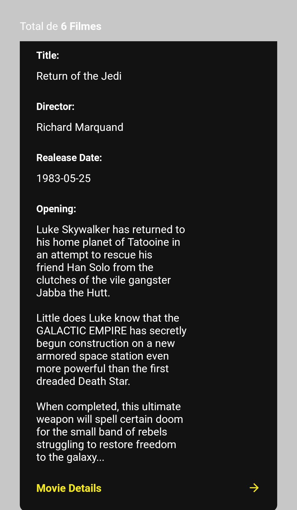
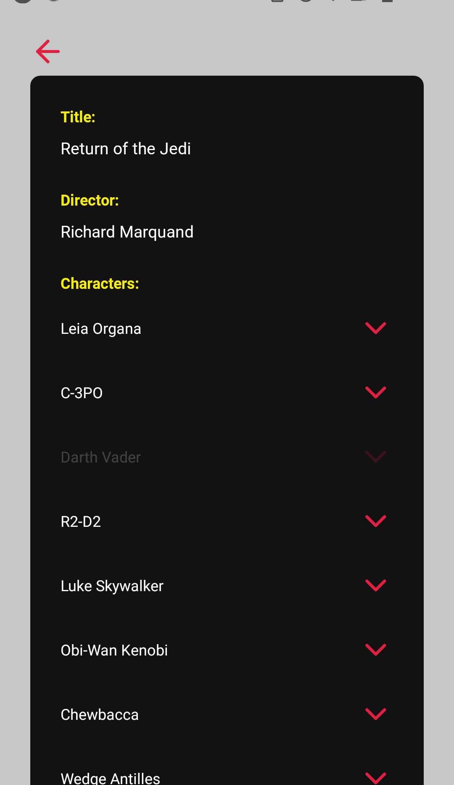
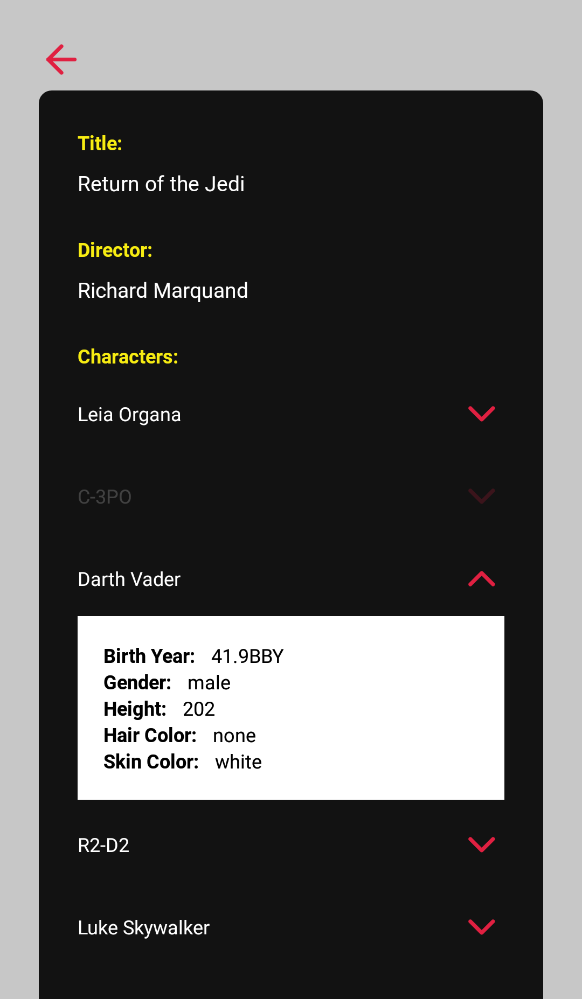

<h1 align="center">
    
</h1>

<h2 align="center"> Aplicação que consome a API [SWAPI](https://swapi.dev/) </h2>

<h3 align="center"> Criada com  React Native </h3>

## Para rodar a aplicação

> OBS: pode-se utilizar o gerenciador de pacotes npm ou o yarn para rodar os comandos abaixo

Execute ```npm install```, para instalar as dependências.

Rode ```npm start``` , acesse **localhost:19002**, leia o QR Code no seu celular e utilize o aplicativo  Expo para rodar a versão mobile no seu smartphone. Ou com algum emulador Android/iOS para rodar no seu computador.

## Telas

<p align="center">
    
    
    
</p>

---

